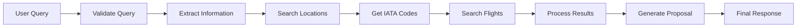

# 🛫 Flight Search Agent

An intelligent travel agent powered by **LangGraph**, **Google Gemini**, and the **Amadeus API**. Built with **Hexagonal Architecture** principles for maximum modularity, testability, and maintainability.

## 🎯 Overview

Flight Search Agent is an AI-powered assistant that helps users find flights through natural language conversation. It leverages:

- **LangGraph** for workflow orchestration
- **Google Gemini** for natural language processing
- **Amadeus API** for real-time flight and location data
- **FastAPI** for a modern web interface
- **Langfuse** for observability and monitoring

## 🏗️ Architecture

This project implements **Clean Architecture** (Hexagonal Architecture) with a **modular design**:

```
┌─────────────────────────────────────────────────────────┐
│                   Architecture Layers                   │
├─────────────────────────────────────────────────────────┤
│                                                          │
│  DOMAIN LAYER      → Pure business logic                │
│  (No dependencies) → Entities & Interfaces             │
│                                                          │
│  APPLICATION LAYER → Use cases orchestration            │
│  (Domain only)     → Business workflows                 │
│                                                          │
│  INFRASTRUCTURE    → External implementations           │
│  (Implements Domain) → API clients, repositories        │
│                                                          │
└─────────────────────────────────────────────────────────┘
```

### Core Principles

1. **Dependency Inversion**: High-level modules don't depend on low-level modules
2. **Interface Segregation**: Clean contracts between layers
3. **Single Responsibility**: Each module has a focused purpose
4. **Testability**: Easy to mock and test each component

## 📁 Project Structure

```
src/
├── flights/                    # Flight search module
│   ├── domain/                # Business entities & interfaces
│   │   ├── flights_entities.py         # Flight, Itinerary, FlightSegment
│   │   └── flights_repository.py       # FlightRepository (interface)
│   ├── application/           # Use cases
│   │   └── search_flights.py            # SearchFlights orchestrator
│   └── infrastructure/        # External implementations
│       ├── search_flights_repository.py # Amadeus implementation
│       └── search_flights_tools.py     # LangChain tool wrapper
│
├── locations/                  # Location search module
│   ├── domain/
│   │   ├── location_entities.py        # Location entity
│   │   └── location_repository.py      # LocationRepository (interface)
│   ├── application/
│   │   └── search_locations.py         # SearchLocations orchestrator
│   └── infrastructure/
│       ├── search_locations_repository.py
│       └── search_locations_tools.py
│
├── llms/                       # LLM service abstraction
│   ├── domain/
│   │   ├── llm_entities.py             # LLM request/response models
│   │   └── llm_service.py              # LLMService (interface)
│   ├── application/
│   │   └── get_chain.py                # Chain factory
│   └── infrastructure/
│       ├── google_client.py            # Google Gemini client
│       └── google_service.py          # Google implementation
│
├── travel_agent/               # Main orchestration module
│   ├── domain/
│   │   ├── entities.py                 # Query validation models
│   │   ├── prompts.py                  # System prompts
│   │   └── travel_entities.py          # Travel-specific entities
│   ├── application/
│   │   ├── graph.py                    # LangGraph definition
│   │   ├── nodes.py                    # 7 workflow nodes
│   │   ├── state.py                    # ConversationState
│   │   └── conditions.py               # Edge conditions
│   └── infrastructure/
│       ├── dependency_injection.py     # DI Container
│       ├── graph_factory.py            # Graph compiler
│       └── workflow_factory.py         # Workflow factory
│
├── web_api/                     # FastAPI web interface
│   ├── domain/
│   │   └── entities.py                 # API request/response models
│   └── infrastructure/
│       ├── fastapi_app.py              # FastAPI application
│       └── handle_request.py           # Request handler
│
├── amadeus/                     # Amadeus API client
│   └── infrastructure/
│       └── amadeus_client.py           # OAuth2 & HTTP client
│
├── observability/               # Monitoring & observability
│   └── infrastructure/
│       └── langfuse_client.py          # Langfuse integration
│
└── shared/                      # Shared utilities
    ├── config.py                       # Pydantic Settings
    ├── logging.py                      # Logger configuration
    └── rate_limiter.py                 # Rate limiting
```

## 🔄 Workflow

The travel agent follows a **LangGraph state machine** workflow:



### Workflow Nodes

1. **Check User Query** - Validates if the query has required information
2. **Extract Information** - Extracts origin, destination, dates, budget
3. **Search Locations** - Finds IATA codes for cities
4. **Process Location Results** - Structures location data
5. **Search Flights** - Queries Amadeus API for flight options
6. **Process Flight Results** - Structures flight data
7. **Proposal** - Generates final travel proposal using LLM

## 🚀 Features

- ✅ **Natural Language Query** - Users can describe their travel needs in plain English
- ✅ **Intelligent Information Extraction** - Automatically extracts travel details from conversations
- ✅ **Real-time Flight Search** - Live data from Amadeus API
- ✅ **Location Intelligence** - Automatic IATA code resolution for cities
- ✅ **Budget Tracking** - Compares flight prices with user's budget
- ✅ **Rate Limiting** - Controlled API usage with rate limiting
- ✅ **Comprehensive Logging** - Detailed logs for debugging and monitoring
- ✅ **Observability** - Langfuse integration for LLM monitoring
- ✅ **Modular Design** - Easy to extend and maintain
- ✅ **Type Safety** - Full type hints and Pydantic validation

## 🛠️ Tech Stack

| Layer | Technology |
|-------|-----------|
| **Framework** | FastAPI |
| **LLM** | Google Gemini |
| **Orchestration** | LangGraph, LangChain |
| **API Client** | Requests |
| **Validation** | Pydantic |
| **Observability** | Langfuse |
| **Configuration** | Pydantic Settings, python-dotenv |
| **Logging** | Python Logging |

## 📋 Prerequisites

- Python 3.11+
- Amadeus API credentials (Test environment)
- Google API key for Gemini
- Langfuse account (optional, for observability)

## ⚙️ Installation

1. **Clone the repository**
   ```bash
   git clone <repository-url>
   cd FlightSearchAgent
   ```

2. **Install dependencies**
   ```bash
   uv sync  # or pip install -r requirements.txt
   ```

3. **Configure environment variables**
   Create a `.env` file in the root directory:
   ```env
   GOOGLE_API_KEY=your_google_api_key
   MODEL_NAME=gemini-2.5-flash
   
   AMADEUS_CLIENT_ID=your_amadeus_client_id
   AMADEUS_CLIENT_SECRET=your_amadeus_client_secret
   
   LANGFUSE_PUBLIC_KEY=your_langfuse_public_key
   LANGFUSE_SECRET_KEY=your_langfuse_secret_key
   LANGFUSE_HOST=https://cloud.langfuse.com
   
   RATE_LIMIT_MAX_REQUESTS=5
   RATE_LIMIT_WINDOW_SECONDS=60
   ```

## 🎮 Usage

### Running the Application

```bash
# Start the FastAPI server
python -m src.web_api.infrastructure.fastapi_app

# Or using uvicorn directly
uvicorn src.web_api.infrastructure.fastapi_app:app --reload
```

The API will be available at `http://localhost:8000`

### API Endpoint

**POST** `/generate-response`

**Request:**
```json
{
  "user_query": "I want to travel from New York to Paris from March 15 to March 25, budget is $2000"
}
```

**Response:**
```json
{
  "response": "Great! I found flight options for your trip from New York to Paris...",
  "state": {
    "origin": "New York",
    "destination": "Paris",
    "start_date": "2024-03-15",
    "end_date": "2024-03-25",
    "budget": 2000.0,
    "flight_results": "..."
  }
}
```

## 📊 Architecture Benefits

### 🔒 Dependency Inversion
High-level business logic doesn't depend on external implementations. Interfaces defined in Domain layer are implemented in Infrastructure layer.

### 🧪 Testability
Each layer can be easily mocked:
```python
# Easy to mock repositories
mock_repository = MockRepository()
use_case = SearchFlights(repository=mock_repository)
```

### 🔄 Maintainability
Changes in external APIs don't affect business logic. For example, switching from Amadeus to another provider only requires implementing the interface.

### 📈 Scalability
Modular design allows adding new features without affecting existing modules.

### 🔍 Observability
Every component is logged and monitored through Langfuse.

## 🔍 Key Concepts

### Domain Layer
- Contains pure business entities (Flight, Location, etc.)
- Defines repository interfaces (FlightRepository, LocationRepository)
- **No external dependencies** - pure Python

### Application Layer
- Implements use cases (SearchFlights, SearchLocations)
- Orchestrates business logic
- Depends only on Domain interfaces

### Infrastructure Layer
- Implements Domain interfaces with external APIs
- Handles HTTP requests, authentication, data parsing
- Can be swapped without changing business logic

## 🛡️ Design Patterns

### Repository Pattern
```python
# Domain interface
class FlightRepository(ABC):
    @abstractmethod
    async def search_flights(self, request: FlightSearchRequest) -> List[Flight]:
        pass

# Infrastructure implementation
class SearchFlightsRepository(FlightRepository):
    def __init__(self, client: AmadeusClient):
        self.client = client
    
    async def search_flights(self, request):
        # Implements using Amadeus API
        pass
```

### Dependency Injection
```python
# Dependency Container
class DependencyContainer:
    def get_flight_tool(self):
        amadeus_client = self.get_amadeus_client()
        repository = SearchFlightsRepository(amadeus_client)
        service = SearchFlights(repository)
        return SearchFlightsTools(service)
```

### Factory Pattern
```python
# Graph Factory
def get_compiled_graph():
    container = get_container()
    nodes = WorkflowNodes(...)
    graph = create_graph(nodes)
    return graph.compile()
```

## 📝 Logging

The application uses structured logging at multiple levels:

- **File logging**: Daily log files in `src/logs/`
- **Console logging**: Real-time output
- **Function tracking**: Entry, exit, and error logging
- **Context logging**: Request parameters and results

Example log entry:
```
2024-01-15 10:30:45 - SearchFlights - INFO - execute - Calling execute with params: {"origin": "NYC", "destination": "PAR", ...}
```

## 🔐 Security

- API credentials stored in environment variables
- Token-based authentication for Amadeus API
- Rate limiting to prevent abuse
- Structured logging without sensitive data exposure

**Built with ❤️ using Clean Architecture principles**